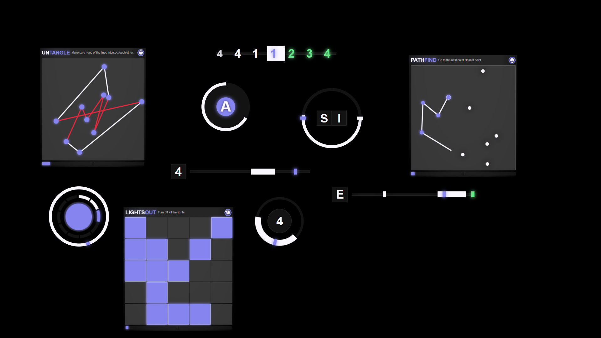

# Byte Labs UI 🚀

**Unlock Endless Fun and Challenge in FiveM!**

## Introduction
Welcome to **Byte Labs UI**, a cutting-edge collection of **Svelte minigame scripts** designed for FiveM! 🎮 This repository offers a variety of engaging, reusable, and highly configurable minigame scripts to elevate your gameplay experience.

## [Documentation](https://docs.byte-labs.net/bl_ui)

## Features
- 🎯 **Unique Skillchecks**: Simple yet addictive challenges to test players' skills
- 🤖 **Innovative Hacking Games**: Never-before-seen puzzles to challenge players' minds
- 📊 **Configurable Parameters**: Easily adjust difficulty levels to suit your needs
- 🔄 **Multiple Iterations**: Optional repeated challenges for increased replayability
- 🎧 **Custom Sounds**: Brand-new audio effects for full immersion
- ⚡️ **Async-Friendly**: Seamlessly integrates with existing scripts with no performance impact
- 📈 **Easy Integration**: Drop-in compatibility with any FiveM setup

## Minigames
- **CircleProgress**
- **Progress**
- **KeyCircle**
- **KeySpam**
- **NumberSlide**
- **RapidLines**
- **CircleShake**
- **PathFind**
- **CircleSum**
- **DigitDazzle**
- **LightsOut**
- **MineSweeper**
- **PrintLock**
- **Untangle**
- **WaveMatch**
- **WordWiz**
- *...more hacking minigames planned*

## Perfect for:
- 🏦 **Robberies**: Add thrilling minigames to heighten tension
- 📝 **Simple Tasks**: Inject engaging challenges into everyday gameplay
- 🎯 **Custom Missions**: Craft unique experiences with ease

## Technical Details
- Built with **Svelte** for optimal performance
- **Asynchronous** design for seamless integration
- **Modular** architecture for easy customization

## Contributions
We welcome:
- 🤝 New **minigame ideas**
- 💡 Feature requests
- 🐛 Bug reports
- 👨‍💻 Pull requests

## Join the Community
Share your experiences, suggestions, and feedback:

### [Discord](https://discord.gg/WQ8XJywfhX)
### [Web Site](https://www.byte-labs.net/)

## Stay Updated
Watch this repository for:
- 📣 **New minigame releases**
- 🛠️ **Updates and patches**
- 🏆 **Community showcases**

Get ready to revolutionize your FiveM experience!  
**Happy gaming!** 😄
